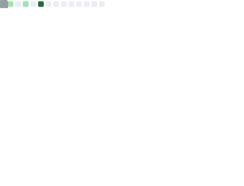

# Hi, I'm Benjamin! 👋

<table>
  <tr>
    <td>
      
    </td>
    <td>
      
       
      
    </td>
  </tr>
</table>

## About me

I am a student of Faculty of computer and information science in Ljubljana with an iterest in programming backend applications, video games, physics and game engines using java, C# and C workflows.

## 🛠 Skills

<!---
benjaminplayer/benjaminplayer is a ✨ special ✨ repository because its `README.md` (this file) appears on your GitHub profile.
You can click the Preview link to take a look at your changes.
--->
