# Hi, I'm Benjamin! 👋

<table>
  <tr>
    <td>
      
    </td>
    <td>
      
       
      
    </td>
  </tr>
</table>

## About me

I'm a computer scinece student at Elektrotehniška in računalniška šola Nova Gorica.

## 🛠 Skills

## Socials

<!---
benjaminplayer/benjaminplayer is a ✨ special ✨ repository because its `README.md` (this file) appears on your GitHub profile.
You can click the Preview link to take a look at your changes.
--->
